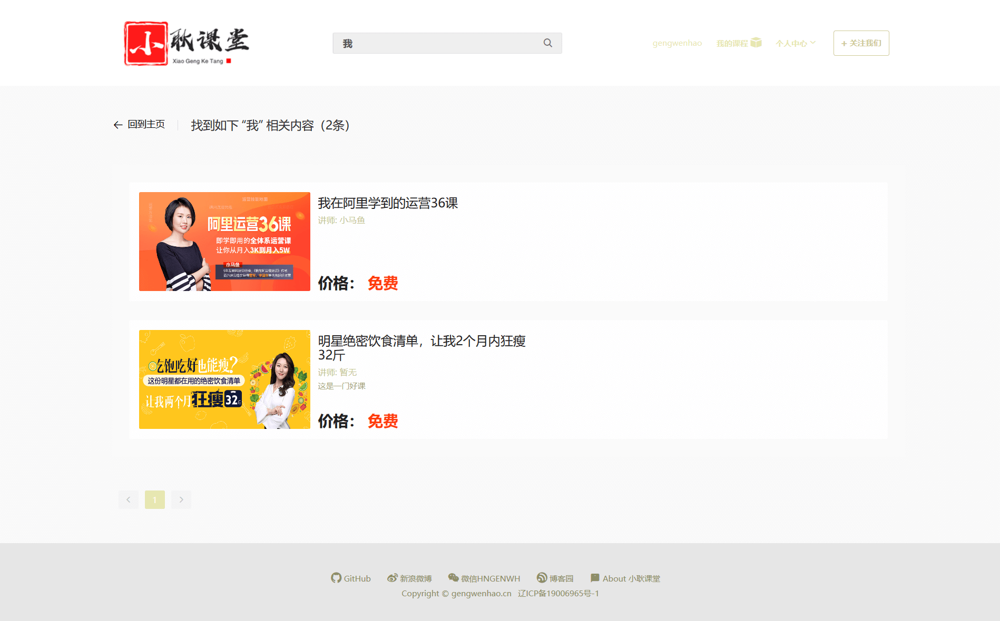
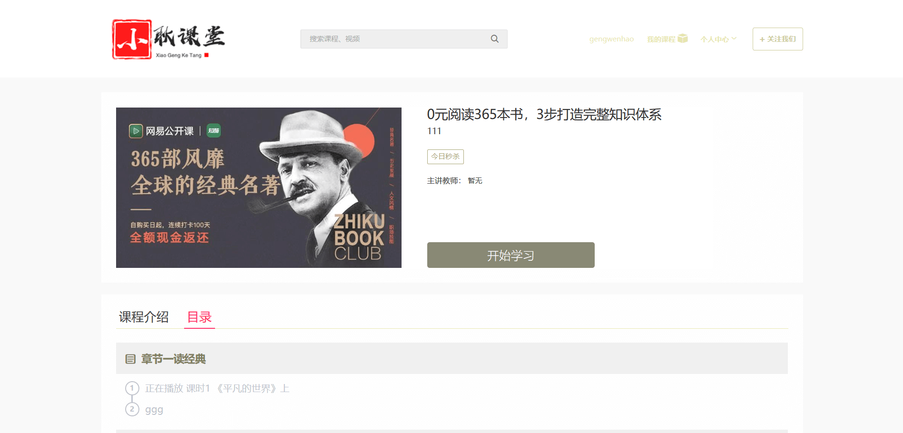
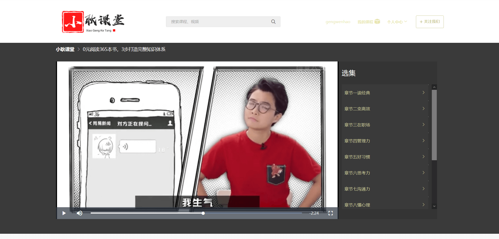

<h3 align="center">基于Vue和Django开发的在线视频教学网站</h1>

	      <a href="//github.com/gengwenhao">

<h4 align="center">首页</h4>

<h4 align="center">搜索结果</h4>

<h4 align="center">课程介绍</h4>

<h4 align="center">课程播放</h4>

